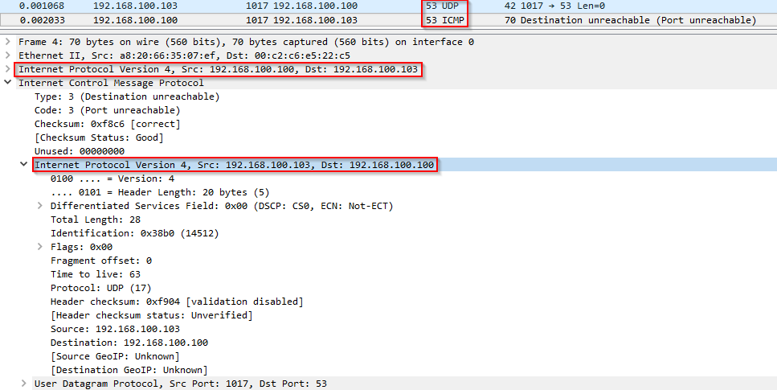

When first starting to do centralized logging for a network is surprizing to see how much cleaning has to be done: from poorly disigned apps, to old and miscofiguration, etc.

One of the most common is to see **DNS denied traffic** on firewall logs. And most of it actually **ICMP Destination Unreachable, Port Unreachable**. 

What happens in this case is that we are performing DNS queries to IPs that are not actually DNS servers, or were and have been decomissioned. As we are guilty of not always cleaning up the coonfigurations after this king of changes, we end up with seeing many (many many depending on the network size) logs like this:

```
Apr 22 2018 17:36:12: %ASA-4-313005: No matching connection for ICMP error message: icmp src OUTSIDE:10.10.10.10 dst INSIDE:10.20.20.20 (type 3, code 3) on OUTSIDE interface. Original IP payload: udp src 10.20.20.20/53 dst 10.10.10.10/24750.
```

What this actually meas is that 192.168.100.10 does a DNS query to 192.168.300.30 on UDP port 53, and as the port is not open, it replies with a ICMP type 3 code 3 message. (https://tools.ietf.org/html/rfc792)

As it can be seen in the Wireshark capture (with different IP, as it's in a lab environement), in the ICMP reply we have the initial DNS request, as it's also staten in the firewall log.



Our firewalls block this, and the **_No matching connection_** message shows that it doesn't realte the DNS request with the ICMP reply. And as the "best practice" says to block all ICMP traffic, here we have it.

So in this case, the solution is: 
* track the source IP, check if a DNS server (based on the high number of requests) and change is configuration
* identifying what is the destination and why was it configured like this in the first place

Perfect for spring cleaning the dashboards and the logs :stuck_out_tongue_winking_eye:
