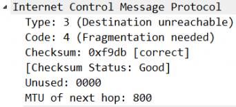

Every domain has a bible we always hear about. When I was yound and starting into networking, too many years ago, we were all talking about [*Tanenbaum's Computer Networks*](https://www.amazon.com/Computer-Networks-4th-Andrew-Tanenbaum/dp/0130661023/ref=pd_lpo_sbs_14_t_0?_encoding=UTF8&psc=1&refRID=55BYF0116DMXVHFS1CA9) as the Networking Bible.
On those times I even knew at what page is concept was. And of course, one that gave everyoane some head ackes, was the *TCP Sliding Window Mechanism*. It has its own chapter. 

But in practice, there's something more to it than just RTTs and ACKs. Now knowing this, and Googling a little, it's very easy to arrive to all the RFCs or other explanations from vendors or other blogs.  But for me, some years ago, it all started with: **_The webapp is slow_**. The web app was actually uploading/downloading some large PDFs and it was getting slower and slower until completly stopping. 

So we put Wireshark on the web server, of course, and we've seen as the Windows size was decreasing and decreasing untill arriving to **0** (zero). That explained what the users were experiencing, but why?

Seems that this was happening only with some particular accesses that were crossing some weird WAN links, with a lower MTU. And here we enter the world of _RFC 1191: Path MTU Discovery_. Basically the mechanism of determining the MTU for an internet path. And this uses ICMP messages to determine the maximum trasmission unit, in particular **Type 3 Code 4: Fragmentation Needed and Don't Fragment was Set**, which informs the source that the packets have to be fragmented to cross the link.

So this was not a Layer 4 window size problem. The actual problem was that the frames were to big to cross the links, but that information was not being received. Also the packets did not have the _Fragment_ bit set, what the ICMP was actually asking the source to do.

As we were following best practices, of blocking **ALL** ICMP, of course those message were not arriving to the source, and as they were not receiving ACKs they were lowering and lowering the windows size.

If you see many ICMP Type 3 Code 4 denied by the firewalls, it means that on the path there is a link with a lower MTU and users have problems with high volume transfer. 

The solution to this problem and many other weird TCP/IP behaviours, is to allow ICMP Type 3 even on the boarder. In the end, the important part in ICMP is the **C** and is not just the _ping_ protocol, it’s a very useful Control mechanism.

Cisco’s [ASA configuration guide](https://www.cisco.com/c/en/us/td/docs/security/asa/asa84/configuration/guide/asa_84_cli_config/access_management.html#wp1268102) also recommends allowing ICMP Type 3: 
